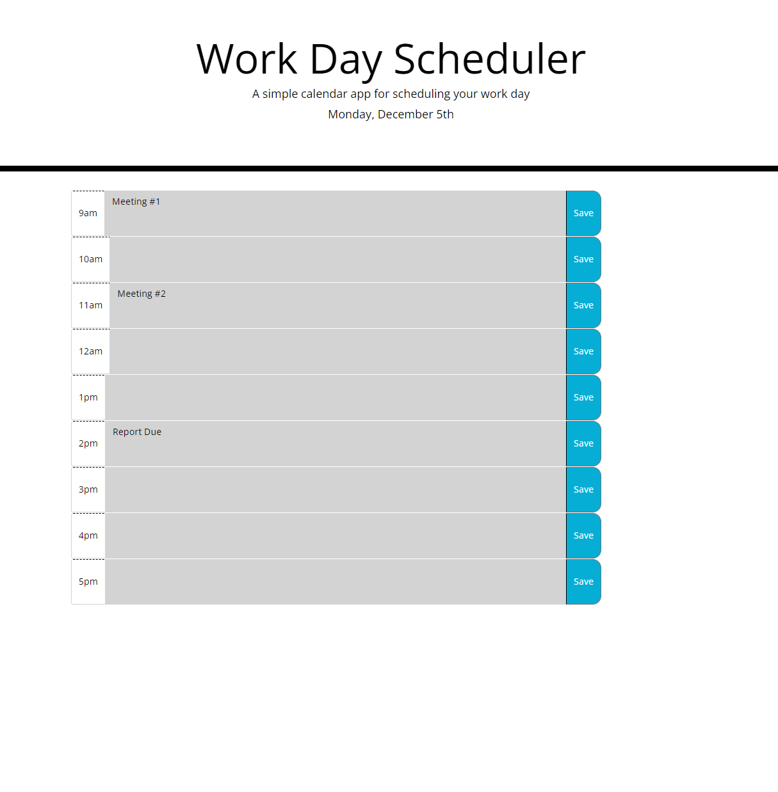

# 05-christians-calender-app

## Description

This project focused on creating a schedule to help stay organized during work hours

This was done by:

-Building out timeblock in HTML and CSS using Bootstrap to help.\
-Utilizing javaScript to track the date and time to keep the schedule up to date.\
-Building functinality in javascript and HTML to take user input and commit the data to local storage so the data can be persistent.

This was done because:

-Keeping track of important tasks is important to be efficent.\
-It can be easy to get caught up in other work and forget upcoming responsibilities.

## Installation

N/A

## Usage

Website is live at: https://christiangroselle.github.io/05-christians-calender-app/

screenshot:  *Note the example image was taken after 5pm, so all timeslots are in the past

## Credits

Source code provided with assignment

other: N/A

## License

Please refer to the LICENSE in the repo.

---